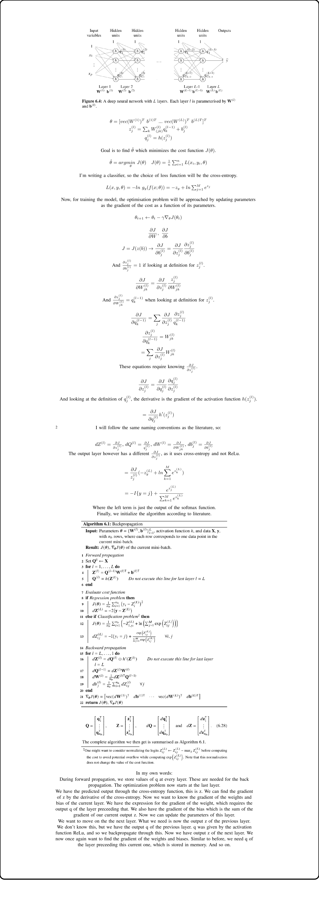

# JonteAI
My own implementation of a dense feed-forward network in C++.

Source: pp.133-145. MACHINE LEARNING, A First Course for Engineers and Scientists. Lindholm, A. Wahlström, N. Lindsted, F. Schön, T.

---

