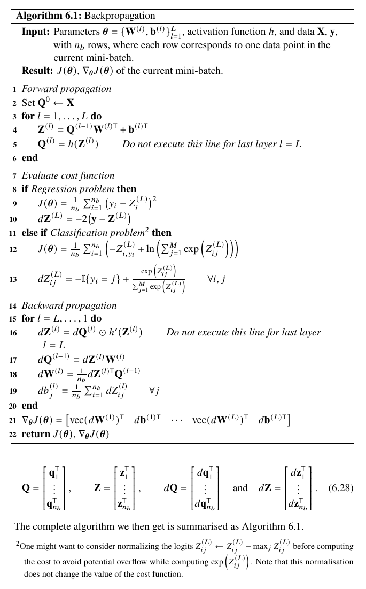

# JonteAI
My own implementation of a dense feed-forward network in C++.

Source: pp.133-145. MACHINE LEARNING, A First Course for Engineers and Scientists. Lindholm, A. Wahlström, N. Lindsted, F. Schön, T.

---

# The Math

### Definitions:

$$
\theta=[vec(W^{(1)})^T b^{(1)T} \, ... \, vec(W^{(L)})^T b^{(L)T}]^T
$$

$$
z^{(l)}_j=\sum_k W_{(jk)}^{(l)}q_k^{(l-1)}+b_j^{(l)}
$$

$$
q_j^{(l)}=h(z_j^{(l)}) \quad ReLu \, activation \, function
$$

$$
\hat{\theta}=arg\underset{\theta}{min} \, J(\theta)
\quad
J(\theta)=\frac{1}{n}\sum_{i=1}^{n}L(x_i , y_i , \theta)
$$

### Softmax & cross-entropy

This equation however combines softmax with cross-entropy according to literature.

$$
L(x,y,\theta)=-ln \ g_y(f(x;\theta))=-z_y+ln\sum_{j=1}^M e^{z_j}
$$

Softmax:

$$
\hat{y}_j = \frac{e^{z_j}}{\sum_{k=1}^{C}e^{z_k}}
$$

Cross-entropy:

$$
L=-\sum_{j=1}^{C}y_j log(\hat{y}_j)
$$

### The optimization problem

$$
\theta_{t+1} \leftarrow \theta_t - \gamma\nabla_{\theta}J(\theta_t)
$$

### Finding $db$

$$
J=J(z(b)) \rightarrow \frac{\partial J}{\partial b_j^{(l)}}=\frac{\partial J}{\partial z_j^{(l)}}\frac{\partial z_j^{(l)}}{\partial b_j^{(l)}}
$$

$$
\frac{\partial z_j^{(l)}}{\partial b_j^{(l)}}=1
$$

$$
\rightarrow \frac{\partial J}{\partial b_j^{(l)}}=\frac{\partial J}{\partial z_j^{(l)}}
$$

### Finding $dW$

$$
\frac{\partial J}{\partial W_{jk}^{(l)}}=\frac{\partial J}{\partial z_j^{(l)}}\frac{z_j^{(l)}}{\partial W_{jk}^{(l)}}
$$

$$
\frac{\partial z_j^{(l)}}{\partial W_{jk}^{(l)}}=q_k^{(l-1)}
$$

$$
\rightarrow \frac{\partial J}{\partial W_{jk}^{(l)}}=\frac{\partial J}{\partial z_j^{(l)}} q_k^{(l-1)}
$$

### Finding $dZ$

$$
\frac{\partial J}{\partial z_j^{(l)}}=\frac{\partial J}{\partial q_j^{(l)}}\frac{\partial q_j^{(l)}}{\partial z_j^{(l)}}
$$

$$
\frac{\partial q_j^{(l)}}{\partial z_j^{(l)}}=h'(z_j^{(l)})
$$

$$
\rightarrow \frac{\partial J}{\partial z_j^{(l)}}=\frac{\partial J}{\partial q_j^{(l)}} h'(z_j^{(l)})
$$

### Derivative of softmax and cross-entropy

Literature explains how softmax derivative becomes Jacobian, meaning that each output depends on every input.

$$
J=diag(\hat{y})-\hat{y}\hat{y}^T
$$

Luckily the combination of softmax+cross-entropy leads to a collapse of derivatives.

$$
\frac{\partial L}{\partial z_{ij}}=\frac{\hat{y_{ij}}-y_{ij}}{N}
$$

And so the algorithm mentioned in literature is then followed:

